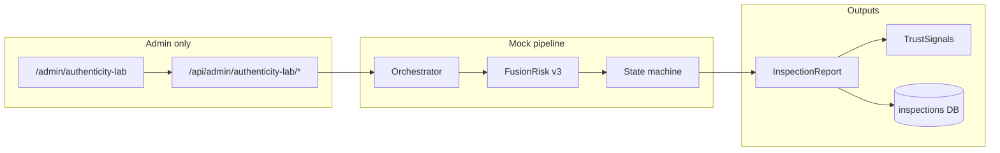
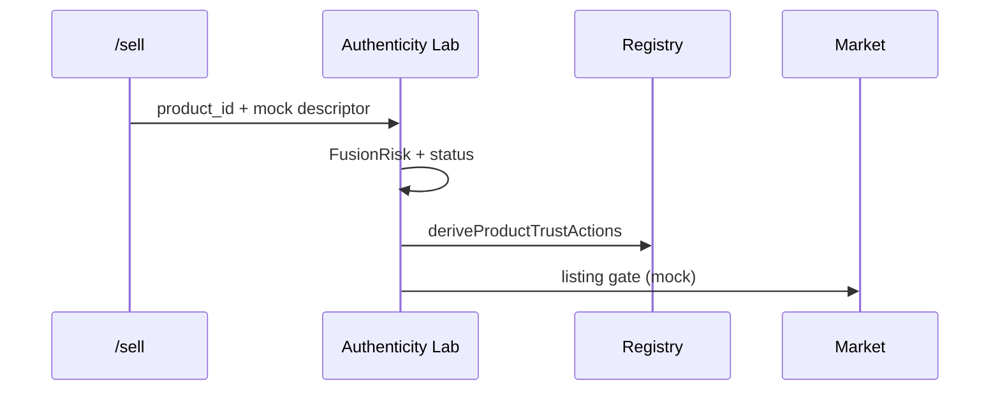

# Authenticity Lab — 아키텍처 (아침용)

## 한 줄 요약

관리자 전용 **mock 검증 파이프라인**. Policy + FusionRisk + 상태머신으로 점수·상태를 만들고, 신뢰 신호를 마켓/등록소/인증에 **매핑만** 한다 (아직 자동 연동 없음).

## 데이터 흐름



## Sell → Market (설계, 미구현)



구현 타입: `trust-flow-integration.ts` → `ProductTrustAction`

## 모듈 책임

| 모듈 | 책임 |
|------|------|
| Upload Gate | mockId 검증 |
| Policy Engine | MIME, 확장자, 키워드 |
| Hash Check | CSAM 분기 구조 (mock hash only) |
| Malware Scan | mock 시그니처 |
| Detection ×3 | mock / stub_external |
| FusionRisk | UARION 가중 융합 |
| Human Review | voice 항상 검토, dual reviewer 큐 |
| Report Builder | expression guard |

## FusionRisk v3 (독자 로직)

- Confidence로 모달리티 점수 보정
- metadata / label / correlation 부스트 분리
- `trustTierFromFusion` → trust-flow 레벨

**의도:** voice는 fusion 가중치는 낮지만 `review_rules.always_review_modalities`로 Human Review 강제.

## 테스트

```bash
npm run test   # 72+ tests
npm run build
```
